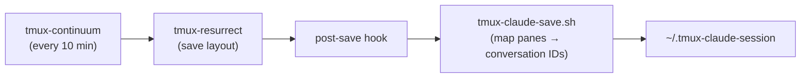

# Tmux + Claude Code Session Persistence

Automatically save and restore your tmux layout **and** resume Claude Code conversations across reboots and crashes.

## What It Does

- **Auto-saves** tmux sessions every 10 minutes (layout, pane contents, running processes)
- **Auto-restores** sessions on tmux startup
- **Tracks Claude conversations** — maps each tmux pane to its active Claude conversation ID
- After restore, Claude panes reconnect to where you left off via `claude --continue`

## Prerequisites

```bash
# Install tmux plugin manager (TPM)
git clone https://github.com/tmux-plugins/tpm ~/.tmux/plugins/tpm
```

## Installation

```bash
# From repo root
cp devops/tmux-claude/tmux.conf ~/.tmux.conf
cp devops/tmux-claude/tmux-claude-save.sh ~/.tmux-claude-save.sh
chmod +x ~/.tmux-claude-save.sh

# Install plugins (inside tmux, press prefix + I)
tmux source ~/.tmux.conf
# Then press Ctrl-b + I to install plugins
```

## How It Works



1. **tmux-continuum** triggers a save every 10 minutes
2. **tmux-resurrect** captures window/pane layout and running processes
3. A **post-save hook** runs `tmux-claude-save.sh`
4. The script finds all panes running `claude`, looks up the most recent conversation ID from `~/.claude/projects/`, and writes mappings to `~/.tmux-claude-session`
5. On restore, resurrect restarts `claude --continue` in the right panes (configured via `@resurrect-processes`)

## Session File Format

`~/.tmux-claude-session` stores one line per Claude pane:

```
session:window.pane|working_directory|conversation_id
```

Example:
```
inf:0.1|/home/user/projects/dyna|cad96d10-5b3d-4a30-a38a-2d37d0b742bc
mac:0.0|/home/user/projects/dyna|a1b2c3d4-e5f6-7890-abcd-ef1234567890
```

## Key Bindings

| Binding | Action |
|---------|--------|
| `Alt+1` | Even horizontal layout |
| `Alt+2` | Even vertical layout |
| `Alt+3` | Main horizontal layout |
| `Alt+4` | Main vertical layout |
| `Alt+5` | Tiled layout |
| `prefix + Ctrl-s` | Manual save (resurrect) |
| `prefix + Ctrl-r` | Manual restore (resurrect) |

## Customization

Edit `~/.tmux.conf` to adjust:
- `@continuum-save-interval` — save frequency in minutes (default: 10)
- `@resurrect-processes` — which commands to restore (default includes `claude --continue` and `claude`)
