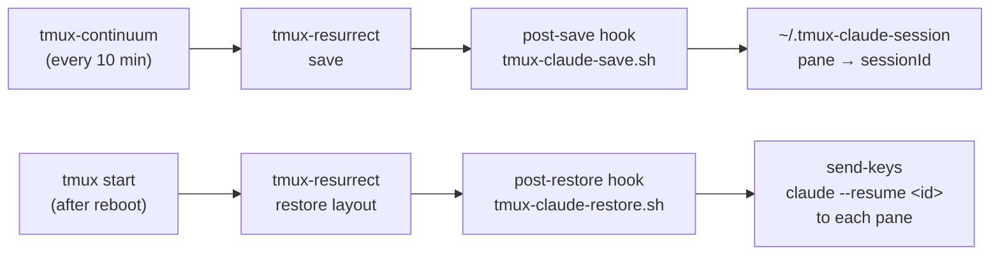

# Tmux + Claude Code Session Persistence

Automatically save and restore your tmux layout **and** resume each Claude Code conversation in the exact pane it was running in — across reboots and crashes.

## What It Does

- **Auto-saves** tmux sessions every 10 minutes (layout, cwd, pane contents)
- **Auto-restores** sessions when tmux starts
- **Per-pane conversation tracking** — each tmux pane is mapped to its own Claude `sessionId`, so a layout with 10 different conversations comes back as 10 different conversations (not 10 copies of the same one)

## Prerequisites

```bash
# Install tmux plugin manager (TPM)
git clone https://github.com/tmux-plugins/tpm ~/.tmux/plugins/tpm
```

## Installation

```bash
# Clone and copy files
git clone https://github.com/johnnywang016/tmux-claude.git /tmp/tmux-claude
cp /tmp/tmux-claude/tmux.conf ~/.tmux.conf
cp /tmp/tmux-claude/tmux-claude-save.sh ~/.tmux-claude-save.sh
cp /tmp/tmux-claude/tmux-claude-restore.sh ~/.tmux-claude-restore.sh
chmod +x ~/.tmux-claude-save.sh ~/.tmux-claude-restore.sh

# Start tmux and install plugins
tmux              # start a session (auto-loads ~/.tmux.conf)
# Inside tmux, press: prefix + I   (default prefix is Ctrl-b)
# This installs tmux-resurrect and tmux-continuum.
```

## Usage

After installation, just use tmux normally. Saves happen automatically every 10 minutes.

**After a reboot**, run `tmux a` (or `tmux attach`) to bring tmux back. Continuum's auto-restore fires when tmux *starts*, not on login — so you do need to launch tmux yourself once per boot. From then on, your full layout and Claude conversations come back automatically.

> If you want it fully hands-off on login, add a macOS LaunchAgent or Linux systemd user unit that runs `tmux new-session -d` at login. That extra step isn't required for this repo to work.

## How It Works



**Save path** (`tmux-claude-save.sh`):
1. Claude Code writes a state file at `~/.claude/sessions/<pid>.json` containing the running session's `sessionId` and `cwd`.
2. The save script reads each file, looks up the pid's controlling tty via `ps`, and matches that tty to a tmux pane via `#{pane_tty}`.
3. It also verifies the conversation `.jsonl` has at least one real user/assistant message (skipping transient stub sessions that `claude --resume` would reject).
4. Writes one line per pane to `~/.tmux-claude-session`:
   ```
   session:window.pane|cwd|sessionId
   ```

**Restore path** (`tmux-claude-restore.sh`):
1. tmux-continuum auto-triggers a resurrect restore on tmux start.
2. tmux-resurrect rebuilds the pane layout and cwd. Panes come back as plain shells — Claude is intentionally **not** in `@resurrect-processes`, so resurrect doesn't race every pane onto the same conversation via `claude --continue`.
3. The post-restore hook reads `~/.tmux-claude-session` and runs `tmux send-keys "claude --resume <sessionId>"` in each mapped pane that's currently at a shell prompt.

## Session File Format

`~/.tmux-claude-session` stores one line per Claude pane:

```
session:window.pane|working_directory|conversation_id
```

Example:
```
dev:0.1|/home/user/projects/myapp|cad96d10-5b3d-4a30-a38a-2d37d0b742bc
dev:0.0|/home/user/projects/myapp|a1b2c3d4-e5f6-7890-abcd-ef1234567890
```

## Key Bindings

| Binding | Action |
|---------|--------|
| `prefix + Ctrl-s` | Manual save (resurrect) |
| `prefix + Ctrl-r` | Manual restore (resurrect) |

## Customization

Edit `~/.tmux.conf` to adjust:
- `@continuum-save-interval` — save frequency in minutes (default: 10)
- `@resurrect-processes` — which commands resurrect should auto-restart on restore. **Do not** add `claude` or `claude --continue` here; this repo handles Claude restart explicitly via the post-restore hook so each pane gets its own conversation. Adding `claude --continue` back would cause every pane to race onto the single most-recent conversation.

## Troubleshooting

**"No conversation found with session ID"** in a restored pane: the conversation file existed at save time but had no real messages (a stub session). The current save script filters these out, but old `~/.tmux-claude-session` files may still reference them. Just trigger a manual save (`prefix + Ctrl-s`) to refresh the mapping.

**Some panes restored to plain shells, not Claude**: those panes weren't running Claude at the last save, or the save couldn't match their tty (e.g. Claude had already exited). Start `claude` manually in those panes.

**Resurrect ran but conversations didn't resume**: check that `~/.tmux-claude-restore.sh` is executable and that `@resurrect-hook-post-restore-all` is set:
```bash
tmux show-options -g | grep resurrect-hook
```
